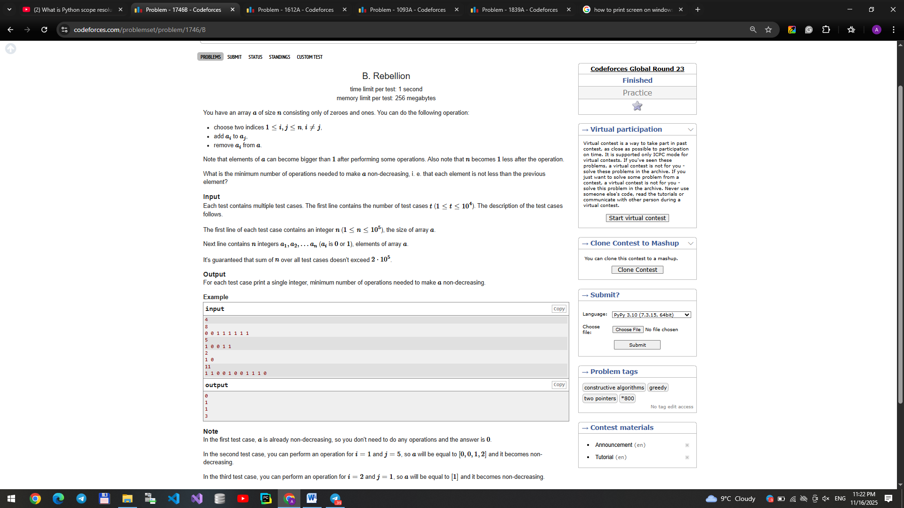

# 🔐 Random Password Generator

A simple and clean Random Password Generator built using HTML, CSS, and JavaScript.

This project allows users to:
- Generate a secure random password
- Copy the password to clipboard
- See a smooth alert notification when the password is copied

---

## 🚀 Live Demo
https://akbarboy777.github.io/random-password-generator/

---

## 🛠 Technologies Used

- HTML5
- CSS3
- JavaScript (Vanilla JS)
- Font Awesome (CDN)

---

## ✨ Features

- Generates a 14-character secure password
- Includes:
  - Uppercase letters
  - Lowercase letters
  - Numbers
  - Special characters
- Copy-to-clipboard functionality
- Smooth animated alert message
- Clean and responsive UI

---

## 📂 Project Structure
├── index.html
├── style.css
├── index.js

---

## 🧠 How It Works

- JavaScript randomly selects characters from a predefined string.
- A loop builds the password character by character.
- navigator.clipboard.writeText() copies the password.
- CSS transitions animate the alert container.

---

## 🎯 Future Improvements

- Add password length customization
- Add checkbox options (include symbols, numbers, etc.)
- Improve mobile responsiveness
- Add strength indicator

---

## 📸 Preview

---

## 👨‍💻 Author

Umarov Akbar
https://github.com/AkbarBoy777
